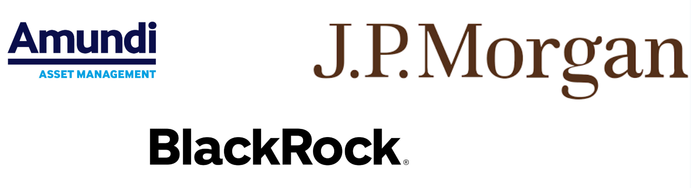

Le secteur financier regroupe l’ensemble des institutions, marchés et instruments qui permettent la gestion et la circulation des capitaux. Il joue un rôle central dans l’économie mondiale en facilitant l’investissement, la gestion des risques et le financement des entreprises et des particuliers. Dans ce contexte, il est important de comprendre les acteurs qui le composent et les enjeux auxquels ils sont confrontés.

## Les acteurs du secteur financier

Pour ne citer que les plus influents, on peut séparer les acteurs du secteur financier en 4 catégories :

### Les banques
Elles offrent des services variés comme la gestion des dépôts, l’octroi de crédits, la tenue de comptes et les transactions financières. Certaines banques sont spécialisées dans la banque de détail (grand public), la banque d’investissement (marchés financiers) ou encore la banque privée (gestion de fortune). 

### Les assurances
Elles permettent de couvrir les risques liés à la vie quotidienne, à l’activité des entreprises et aux investissements financiers. Les compagnies d’assurance analysent des données complexes pour évaluer les probabilités de sinistres et ajuster leurs offres. Leur objectif est de protéger les assurés contre les aléas de la vie tout en garantissant leur rentabilité.

### Les sociétés de gestion de fonds d’investissement
Les sociétés de gestion de fonds d'investissement ( plus connues sous le terme d'Asset Management à l'internationnal) gèrent des fonds d’investissement pour le compte de clients institutionnels ou particuliers. Ces sociétés prennent des décisions basées sur des modèles quantitatifs avancés afin d’optimiser la rentabilité des portefeuilles. Leur objectif est simple, Investir sur les marchés financiers pour obtenir un rendement supérieur à celui des placements traditionnels.

### Les organismes étatiques et régulateurs
Ils supervisent et régulent les marchés financiers pour garantir leur bon fonctionnement, prévenir les crises et protéger les investisseurs. En France, l’Autorité des Marchés Financiers (AMF) joue ce rôle, au Luxembourg, il est joué par la Commission de Surveillance du Secteur Financier (CSSF). Dans un contexte supra-nationnal, on trouve aussi notamment la Banque Centrale Européenne (BCE) et l’Autorité Bancaire Européenne (EBA) en Europe.

:::info[Quelle conséquence sur leurs activités ?] 
Ces différents acteurs prenent tous des décisions stratégiques cruciales pour l’économie mondiale. Il est donc nécessaire dans leurs activitées de s'appuyer sur des données fiables et des modèles statistiques robustes pour anticiper les risques et saisir les opportunités.
:::

## Les statistiques et la finance  

Au cœur des activités financières, les statistiques occupent une place centrale dans la prise de décision. Elles permettent d’analyser, d’anticiper et d’optimiser les stratégies mises en place par les acteurs du secteur. De nombreux domaines reposent sur l’exploitation de modèles statistiques avancés afin d’améliorer la performance et de limiter les risques associés aux opérations financières.

### L’évaluation du risque  

Dans des secteurs comme la gestion d’actifs, l’assurance et l’octroi de crédit, les statistiques jouent un rôle fondamental pour anticiper les fluctuations des marchés et évaluer les probabilités d’événements indésirables.  

- Les **simulations de Monte Carlo** permettent de modéliser différents scénarios économiques pour anticiper l’évolution des actifs financiers et évaluer le risque associé à une stratégie d’investissement.
- Les **modèles bayésiens** sont utilisés pour l’actualisation des probabilités en fonction des nouvelles données disponibles, ce qui est particulièrement utile en gestion des risques.
- La **régression logistique** est couramment employée dans les modèles de scoring de crédit pour estimer la probabilité de défaut d’un emprunteur.
- Le **clustering**, notamment via des algorithmes comme K-Means, permet de segmenter les clients en fonction de leur profil de risque.

### La prévision des marchés  

Anticiper les mouvements des marchés est un enjeu majeur pour les investisseurs et les analystes. Les modèles de **séries temporelles** sont au cœur de ces approches.  

- **ARIMA** (*AutoRegressive Integrated Moving Average*) est utilisé pour modéliser et prévoir l’évolution des prix en identifiant des tendances et des effets saisonniers.  
- **GARCH** (*Generalized Autoregressive Conditional Heteroskedasticity*) permet d’estimer et d’anticiper la **volatilité** des marchés financiers.  
- **LSTM** (*Long Short-Term Memory*), un type de réseau de neurones récurrents, est particulièrement efficace pour capturer les dynamiques des prix sur des périodes longues.  
- **Transformers**, initialement développés pour le traitement du langage naturel, sont de plus en plus utilisés en finance pour l’analyse des séries temporelles complexes et des tendances de marché.

### La valorisation des actifs  

L’**évaluation des actifs financiers** repose sur des modèles mathématiques avancés, qui permettent d’estimer leur juste valeur en fonction du risque et du temps.  

- Le **modèle de Black-Scholes** est une référence pour le pricing des options et repose sur une hypothèse de volatilité constante.  
- Le **modèle de Merton**, extension du modèle Black-Scholes, intègre le risque de défaut de l’émetteur d’une option.  
- Le **modèle de Heston** propose une approche plus réaliste en permettant une volatilité stochastique.

### L’optimisation des stratégies d’investissement  

Maximiser la rentabilité tout en contrôlant le risque est un enjeu clé en finance. Plusieurs approches d’optimisation sont utilisées :  

- Le **modèle de Fama-French** étend le modèle du marché en intégrant des facteurs supplémentaires (valeur, taille des entreprises) pour expliquer la performance des actifs.  
- Les **méthodes de clustering** permettent de regrouper des actifs présentant des comportements similaires afin de diversifier efficacement un portefeuille.  
- Le **Reinforcement Learning** est une approche en pleine expansion qui permet de construire des stratégies de trading adaptatives en fonction des signaux de marché.

:::tip[En bref]
Les statistiques sont un outil essentiel pour les acteurs du secteur financier. Elles permettent de modéliser les risques, de prédire les tendances et d’optimiser les décisions d’investissement. Il est existe de nombreuses méthodes statistiques et algorithmes performants qui sont utilisés pour ces tâches. Dans ce contexte florissant d'algorithmes en tout genre, il est nécessaire de recentrer l'étude sur un domaine plus précis : l'analyse de sentiment.
:::

## L'analyse de sentiment dans le secteur financier

Si les modèles statistiques et l’intelligence artificielle permettent d’optimiser la gestion des risques et la prise de décision, une limite importante subsiste : ces modèles sont principalement basés sur des données chiffrées (prix d’actions, taux d’intérêt, volatilité…).

Or, les marchés financiers sont fortement influencés par la psychologie des investisseurs, les actualités économiques et politiques, ainsi que les réactions du public. C’est ici qu’intervient l’analyse de sentiment.

L’analyse de sentiment consiste à exploiter des sources de données textuelles (articles de presse, rapports d’analystes, tweets, forums financiers…) pour extraire des indicateurs de confiance ou de méfiance à l’égard d’un actif ou du marché global. Grâce aux progrès du Traitement Automatique du Langage Naturel (NLP), il est désormais possible d’intégrer cette dimension qualitative dans les modèles de décision financière.