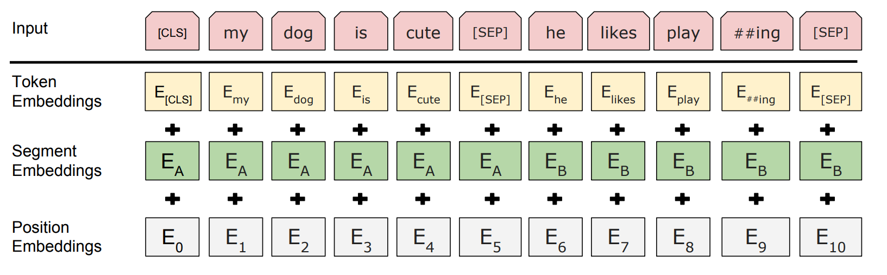
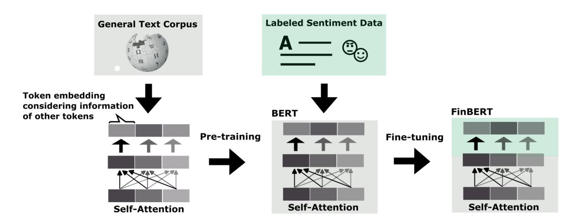
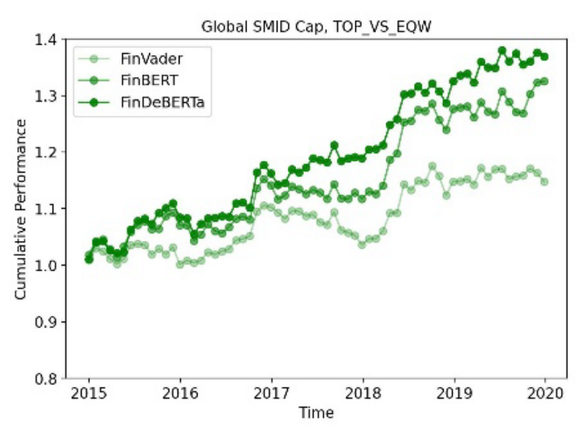
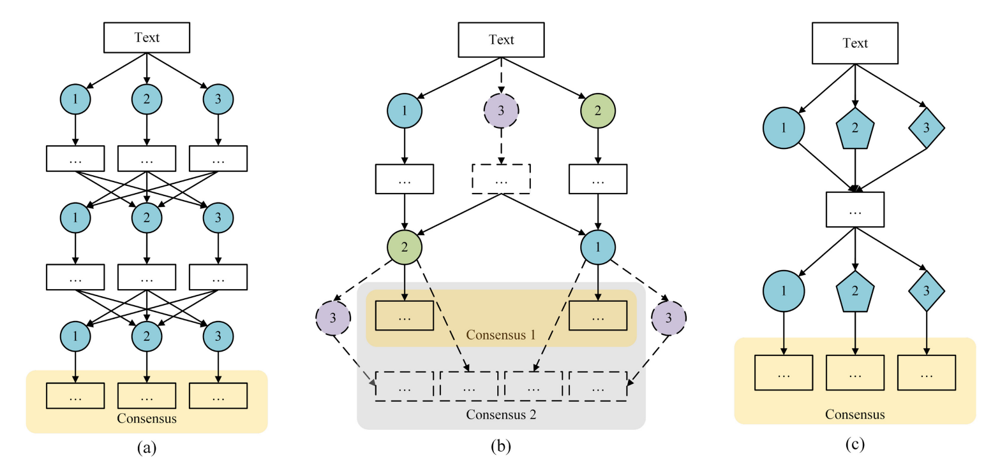
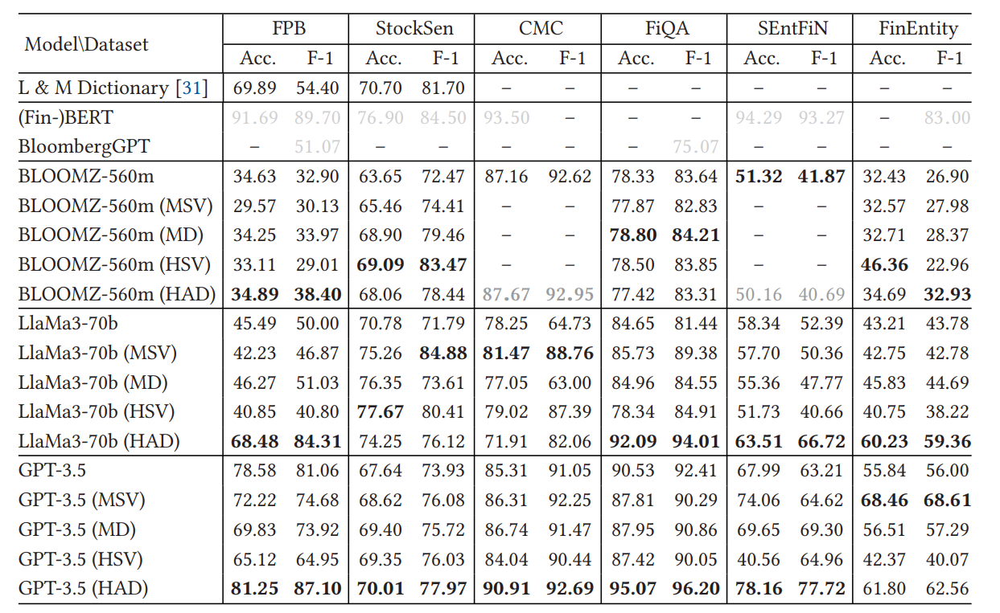

# Les LLMs : une nouvelle façon d'analyser les sentiments

Depuis 2018, les LLMs (Large Language Models) ont révolutionné le domaine du traitement automatique du langage naturel (NLP). Ces modèles, basés sur des réseaux de neurones, sont capables de générer ou comprendre du texte de manière autonome, en fonction d'une tâche donnée. Ces nouvelles structures de traitement de texte ne se contentent plus de reconnaître des mots comme le feraient les dictionnaires, mais sont capables de comprendre le sens des phrases à des niveaux de profondeur parfois plus importants que les humains. 

Il s'agira dans cette section de comprendre comment ces modèles ont permis une avancée majeure dans le domaine de l'analyse de sentiment, et comment ils ont des applications concrètes dans le milieu financier.

## Le finetuning des LLMs pour le rendement anticipé d'actions

Les premiers LLMs sont apparus en 2018, avec le modèle *GPT-1* (Generative Pre-trained Transformer). Peu après est arrivé le premier modèle open source de google : *BERT*. 

*BERT* pour *Bidirectional Encoder Representations from Transformers* se distingue du modèle *GPT* par sa capacité à prendre le contexte précédent et suivant d'un mot, afin de mieux en comprendre le sens. Dans le papier de recherche de ce modèle, les auteurs présentent une structure de réseau de neurone de type *transformer* [\[1\]](#sources). La structure de ce réseau est basée sur un assemblage de couches d'encodeurs de transformers qui possèdent un mécanisme de *multi-head self-attention* et de *feed-forward neural network*. C'est ce qui permet à *BERT* de réaliser l'*embedding* des inputs textuels.

:::info[Embedding]
L'*embedding* est une technique de traitement de texte qui consiste à représenter les mots ou phrases sous forme de vecteurs. L'objectif est de conserver les relations sémantiques entre ces derniers, et de les représenter dans un espace vectoriel. Ainsi, on peut réaliser des opérations mathématiques sur ces vecteurs pour obtenir des informations sur les mots ou phrases qu'ils représentent. Par exemple :

$$
embedding("roi") - embedding("homme") + embedding("femme") \approx embedding("reine")
$$

:::

À l'inverse des techniques de *word-embedding* classiques telles que *Word2Vec* ou *GloVe*, *BERT* est capable de prendre en compte le contexte global du texte pour réaliser l'*embedding* des mots. C'est ce qui lui donne une compréhension plus fine du sens des mots et des phrases. *BERT* va donc réaliser 3 *embeddings* différents pour chaque mot (voir [Figure 1](#bert-embedding)) :
- l'embedding du mot lui-même
- l'embedding de la position du mot
- l'embedding de la position de la phrase dans le texte

Ce sont ces 2 derniers *embeddings* qui permettent à *BERT* de comprendre le contexte global du texte et de détecter ses structures *questions/réponses*.

<figcaption style={{ textAlign: "center" }}><em>Figure 1 : Embedding des inputs dans le modèle BERT [\[1\]](#ref1)</em></figcaption>

L'entrainement d'un modèle de *LLM* comme *BERT* se fait en deux étapes :

**1/ Pré-entrainement** 

Le modèle apprend à réaliser les 3 *embeddings* des mots d'un texte. Pour cela, il est entraîné sur deux tâches principales :
1. *Masked Language Model* : 15% des mots du texte sont masqués, et le modèle doit apprendre à les retrouver en fonction du contexte.
2. *Next Sentence Prediction* : on donne deux phrases, A et B au modèle tel que B est la phrase suivante de A dans 50% des cas. Le modèle doit alors apprendre à déterminer si B est bien la phrase suivante de A.

:::tip[Objectif du pré-entrainement]
Grâce au pré-entrainement, *BERT* apprend deux notions fondamentales pour sa compréhension du langage : La cohérence **contextuelle** et **sémantique** du langage.
:::

**2/ Fine-tuning**

Une fois pré-entrainé, on peut ré-entrainer *BERT* pour qu'il réalise une tâche bien précise. Ayant au préalable acquis un compréhension du langage, il peut maintenant apprendre à réaliser une tâche plus complexe sur les données textuelles. On peut notamment lui apprendre à générer du texte pour répondre à une question ou à réaliser une classification de texte ; pour détecter des spams par exemple.

Dans le contexte de l'analyse de sentiment, on peut utiliser le modèle pré-entrainé de *BERT* pour réaliser une classification des textes en fonction de leur sentiment. C'est notamment ce qu'on réalisé l'équipe *Systematic Equity* chez *RAM AI* [\[2\]](#sources).

:::warning[L'importance de la donnée]
Le pré-entrainement d'un *LLM* comme *BERT* nécessite une grande quantité de données textuelles de bonne qualité. Pour ce faire, on utilise souvent des corpus de textes libres, comme *Wikipedia* ou *Common Crawl*. Cependant, ces données ne sont pas toujours adaptées à la tâche finale que l'on souhaite réaliser. Dans le cadre financier, de nombreux termes techniques ou spécifiques peuvent ne pas être présents dans ces corpus, ou tout du moins pas en suffisamment grande quantité pour que le modèle comprenne pleinement leur sens.
:::

Dans ce contexte financier d'analyse de sentiment, l'équipe de *RAM AI* a donc d'abord réalisé un fine-tuning de *BERT* sur un corpus de données financières avec des étiquettes de sentiments. Ce modèle de langage renommé **FinBERT** est donc maintenant capable de comprendre le langage en général et tout particulièrement le langage financier et les sentiments associés à ce dernier (voir [Figure 2](#finbert)).

<figcaption style={{ textAlign: "center" }}><em>Figure 2 : Fine-tuning de BERT pour l'analyse de sentiment financier [\[2\]](#sources)</em></figcaption>

À partir de **FinBERT**, l'équipe de *RAM AI* a aussi mis au point une version *Ditangled* pour décorréler les mécanismes du modèle *BERT* (notamment sur la dimension la dimension des embeddings et sur le mécanisme d'attention) : **FinDeBERTa**. D'un point de vue des performances, ils ont utilisés ces modèles pour prédire le sentiment des marchés financiers sur des données de nouvelles financières. Leur objectif était de simuler un investissement dans des actions du marché afin d'améliorer leur *rendement* (défini sur la page précédente). En comparant les performances de **FinBERT** et **FinDeBERTa** avec **FinVADER** (un dictionnaire de sentiment axé sur la finance vu sur la page précédente), ils ont obtenus les résultats de la [Figure 3](#finbert-perf).

<figcaption style={{ textAlign: "center" }}><em>Figure 3 : Performances de FinBERT et FinDeBERTa comparées à FinVADER [\[2\]](#sources)</em></figcaption>

:::tip[Ce qu'il faut retenir]
Dans le cadre d'une simulation d'investissement sur le marché des actions, les modèles de *LLM* affinés pour l'analyse de sentiment financier produisent des résultats significativement meilleurs que les dictionnaires de sentiment classiques. Cela est du à leur compréhension plus fine et entière du language financier.
En moyenne, on peut noter une amélioration 3 à 4 fois supérieure à l'utilisation d'un dictionnaire de sentiment (même spécifique à la finance).
:::

## Les Méta-modèles 

Une des avancée les plus surprenante concernant l'utilisation des *LLMs* est leur transformation en agent conversationnel. Ces nouveaux systèmes intelligents sont au coeur de la recherche en IA pour l'analyse de sentiment, notamment dans le domaine financier.

Lorsque l'on travaille dans le milieu financier, ou plus généralement dans un domaine critique, il est important de pouvoir détailler rigouresement le cheminement d'un pensée. Les IAs génératives, comme *FinBERT* de la section précédent ne le font naturellement pas. C'est pourquoi il est souvent nécessaire de leur apprendre à raisonner de façon logique et humaine. Pour ce faire, il existe de nombreuses méthodes, qui permettent en plus d'améliorer la précision et la qualité des réponses de ces agents, dont notamment les *Chain of Thought*, *Tree of Thought* ou encore des mécanismes d'*auto-vérification de la cohérence*.

:::info[*Chain of Thought* et *Tree of Thought*]
Les *Chain of Thought (CoT)* et *Tree of Thoughts (ToT)* sont des techniques d’amélioration du raisonnement pour les modèles de langage. *CoT* guide le modèle à décomposer une tâche en plusieurs étapes explicites, améliorant ainsi la cohérence des réponses. *ToT*, quant à lui, étend cette idée en explorant plusieurs chemins de raisonnement sous forme d’un arbre, permettant au modèle d’évaluer différentes solutions avant de choisir la meilleure. Alors que *CoT* suit un raisonnement linéaire, *ToT* est plus puissant pour les tâches complexes nécessitant une exploration et une prise de décision optimales.
:::

Ces modèles, performants pour analyser les sentiments dans de nombreux domaines, ont pourtant certaines limitations dans leur réflexion. Ils ne sont en effet, pas capables de proposer des raisonnements intellectuels spontanés ; c'est-&-dire autres que dans le cadre qui leur a été appris (*CoT*, *ToT*, ...).Dans l'article *Designing Heterogeneous LLM Agents for Financial Sentiment Analysis* [\[3\]](#sources) Franck Xing dépeint l'utilisation de différents méta-modèles pour palier ces limitations. 

:::info[Les méta-modèles]
Un méta-modèle est une structure conceptuelle qui définit les règles et les relations régissant un ensemble de modèles spécifiques. Il sert de cadre général permettant d’organiser, d’interconnecter et d’adapter différents modèles selon les besoins d’un domaine donné. Dans le contexte des agents conversationnels, un méta-modèle peut orchestrer plusieurs sous-modèles spécialisés (compréhension, génération, mémoire contextuelle, raisonnement, etc.), afin de produire agent plus flexible, capable de mieux structurer ses réponses et d’adapter son comportement aux interactions.
:::

Dans cet article, Franck Xing propose un méta-modèle inspiré de la théorie de l'esprit de Marvin Minsky.

:::note[*The Society of Mind - Marvin Minsky*]
Dans son livre intitulé *The Society of Mind* [\[4\]](#sources), Marvin Minsky présente une approche théorique qui propose que l'intelligence humaine émerge de l'interaction de nombreux agents cognitifs ou modules spécialisés dans le cerveau.
:::

En suivant cette théorie, Franck Xing propose un méta-modèle d'agents conversationnels dont les conversations cherchent à améliorer la qualité de la réflexion de l'agent. Ce modèle, le **HAD** pour **Heterogeneous multi-Angent Discussion**, est composé de 7 types d'agents ; 5 d'entre-eux sont des agents linguistiques et 2 sont des agents financiers :
- **Agents linguistiques**
  - **A1 - agent mood** : détecte les moods irréalistes, c'est-à-dire des expressions qui indiquent des conditions hypothétiques ou improbables. Par exemple : "Si les conditions économiques s'améliorent alors..."
  - **A2 - agent rhétorique** : identifie les rhétoriques, comme le sarcasme ou les assertions négatives.
  - **A3 - agent dépendance** : se concentre sur le sentiment de l'orateur, et non sur celui d'un tiers. Par exemple : "Nous sommes optimistes" (focus sur l'orateur) et "Les analystes sont optimistes" (focus sur un tiers).
  - **A4 - agent aspect** : se concentre sur le sujet principal (par exemple, une action ou un produit) et non sur des aspects secondaires.
  - **A5 - agent référence** : détecte les références temporelles, les prix et autres faits non exprimés.
- **Agents financiers**
  - **A6 - agent institutionnel** : analyse le texte du point de vue d'un investisseur institutionnel, en se concentrant sur les effets fondamentaux à long terme
  - **A7 - agent individuel** : analyse le texte du point de vue d'un investisseur individuel, en se concentrant sur les changements de prix et les indicateurs techniques.

Cette structure de méta-modèle avec différents types d'agents tous focus sur des aspects différents de l'analyse du texte se distingue par sa complexité des autres méta-modèles existants. Cette structure plus complexe mimique en effet plus fidèlement le fonctionnement du cerveau humain, ou à fortiori, d'un analyste financier ou de son équipe : chacun se concentrant sur un aspect particulier de l'analyse. 

<figcaption style={{ textAlign: "center" }}><em>Figure 4 : Différentes structures de méta-modèles en multi-agent, (a) **homogeneous multi-agent debate**, (b) **multi-role multi-agent negotiation**, (c) **heterogeneous multi-agent discussion (HAD)** [\[3\]](#source)</em></figcaption>

Dans la [Figure 4](#had), on peut voir deux autres structures de méta-modèles plus simples que le **HAD** (c) :
- (a) **Homogeneous multi-agent debate** : cette structure présentée par les recherches de Yilun DU et al. [\[5\]](#sources) propose de lier des nombreux agents identiques au sein d'un même modèle. Toujours en s'appuyant sur la théorie de Minsky [\[4\]](#sources), ils ont fait débatre leurs agents pour analyser sentimentalement un texte.
- (b) **Multi-role multi-agent negotiation** : cette structure présentée par les recherches de Xiaofei SUN et al. [\[6\]](#sources), fait intervenir des agents dans une négotiation chacun ayant un rôle différent. Cette structure, plus proche du **HAD**, se distingue par le fait que les agents ont le même type d'analyse ; seul leur rôle dans le débat diffère (négociateur, observateur, ...). Suite aux négociations, le consensus atteint est sytématiquement remis en question. Cela mimique le déroulé d'un vrai débat où le premier consensus n'est pas toujours le bon, et qu'il est parfois nécessaire de revenir sur ses positions.

:::note
On notera que ces deux études [\[5,6\]](#sources) ont été réalisées dans le cadre d'une analyse de sentiment général, et non pas spécifique au milieu financier. Leurs résultats démontraient déjà une meilleure analyse qu'un simple LLM comme *BERT*.
:::

Pour tester l'efficacité de son modèle **HAD**, Franck Xing a utilisé 6 bases de données où ds textes à caractère financier sont annotés en fonction de leur sentiment : *FPB*, *StockSen*, *CMC*, *FiQA*, *SEntFin* et *FinEntity*. Il a comparé les performa,nces de son modèle avec d'autres méta-modèles de référence, tout en faisant varier la t'echnologie de LLM employée (*BLOOMZ*, *LlaMa3* ou *GPT-1*).

<figcaption style={{ textAlign: "center" }}><em>Figure 5 : Performance de **HAD** vis-à-vis de modèles de référence [\[3\]](#source)</em></figcaption>
 
:::tip[Comparaison des performances]
Comme on peut le voir sur la [Figure 5](#had_perf), le modèle **HAD** obtient des performances globalement meilleurs que les autres méta-modèles de référence (*MSV*, *MD* et *HSV*). Ses performances sont aussi meilleures que celle d'un dictionnaire de sentiment financier : *Loughan McDonald* (que l'on avait vu dans la section précédente).

Cependant, on peut noter que les performances de **HAD** et des autre méta-modèles restent globalement bien inférieures à celles du modèle **FinBERT** présenté plus haut. Cette différence significative se fait sur le fait que **HAD** est un modèle conversationnel où les agents ne sont liés entre eux que par un simple biais conversationnel : il n'y a pas d'apprentissage à proprement parlé, seulement de la réflexion. **FinBERT** au contraire a été fine-tuné pour l'analyse de sentiment financier et est lui une structure bien plus complexe et profonde, ce qui explique ses performances supérieures.
:::

## Sources
[\[1\] Deveikyte J, Geman H, Piccari C and Provetti A (2022) A sentiment analysis approach to the prediction of market volatility. Front. Artif. Intell. 5:836809. doi: 10.3389/frai.2022.836809](https://www.researchgate.net/publication/347947909_A_Sentiment_Analysis_Approach_to_the_Prediction_of_Market_Volatility)

[\[2\] Emmanuel Hauptmann, Valentin Betrix, Nicolas Jamet, Tian Guo, Louis-Alexandre Piquet (2024), Financial Sentiment Analysis with Large Language Models: An Introductory & Comparative Study on News Flow](https://www.ram-ai.com/sites/default/files/2024-04/202404_ramai_financial-sentiment-analysis-with-llm.pdf)

[\[3\] Frank Xing. 2025. Designing Heterogeneous LLM Agents for Financial Sentiment Analysis. ACM Trans. Manag. Inform. Syst. 16, 1, Article 5 (February 2025), 24 pages.](https://doi.org/10.1145/3688399)

[\[4\]](#) Marvin Minsky, The Society of Mind, New York, Simon & Schuster, 1986 (ISBN 0-671-60740-5)

[\[5\] Yilun Du, Shuang Li, Antonio Torralba, Joshua B. Tenenbaum, and Igor Mordatch. 2024. Improving factuality and reasoning in language models through multiagent debate. In Proceedings of ICML’24.](https://doi.org/10.48550/ARXIV.2305.14325)

[\[5\] Xiaofei Sun, Xiaoya Li, Shengyu Zhang, Shuhe Wang, Fei Wu, Jiwei Li, Tianwei Zhang, and Guoyin Wang. 2023. Sentiment Analysis through LLM Negotiations](https://doi.org/10.48550/ARXIV.2311.01876)